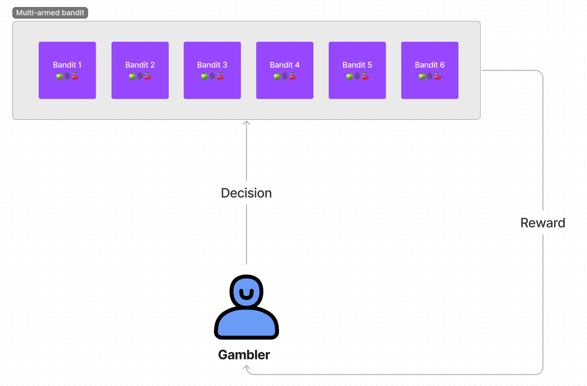
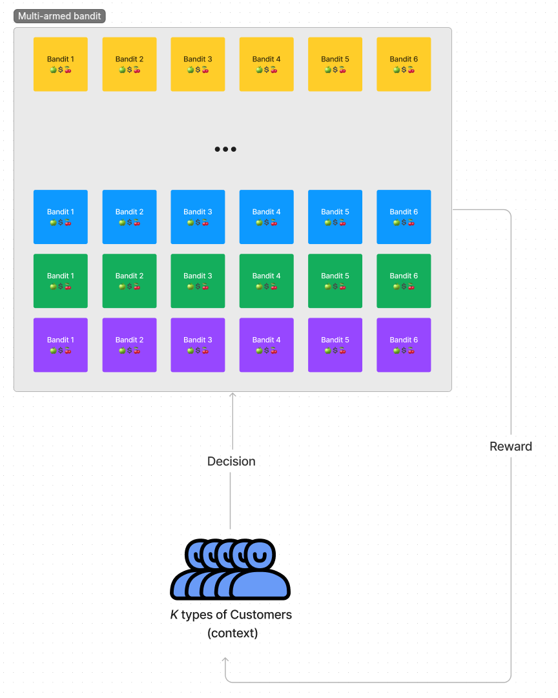

# Multi-armed bandit

### **Story behind the problem**
In a casino, the gambler comes across a row of slot machines with various payoff percentages. The gambler has a limited amount of time and money to spend, but they are unsure of which machine would pay out the most.

Comparable to a gambler trying to decide which machine to use to maximize their wins while minimizing their losses is the multi-armed bandit problem. The gambler must choose which arm to pull (or which machine to play) to get the greatest money overall because each slot machine is like a "arm" of a bandit.

The problem is that the gambler must test out various machines in order to determine which ones are the most profitable because they are unable to determine the precise payout rate of each machine. As they play more, they begin to discover which machines pay out the most, and they modify their tactics as a result.

To increase their overall profits, the gambler appears to be attempting to strike a balance between exploring (playing new machines to learn their payout rates) and exploiting (playing the machines they already know have a high payout rate).

### **Enviroment description**
The gambler have a row of $N$ machines to play on (actions), X coins (each coin indicates one attempts). Desicion indicates on which machine to play. The response of the enfiroment is 1 (win) or 0 (lose) (reward).

 

 
 

### **Solution**
* Q-algorithm (model free reinforcement learning)

 

# Contextual Multi-armed bandit

In contextual MAB the agent has to learn best scenario (best arm to pull) based on the context. We can compare this problem with the online advertising decision making. Let's assume we have ***K*** clinet types based on their cookies information and for each type one of ***N*** adds (*bandits*) has higher click liklihood. So based on context agend should pick the action to maximize the reward which is probability of clicking the ad.

 

 
 

### **Solution**
* Deep Q neural network
